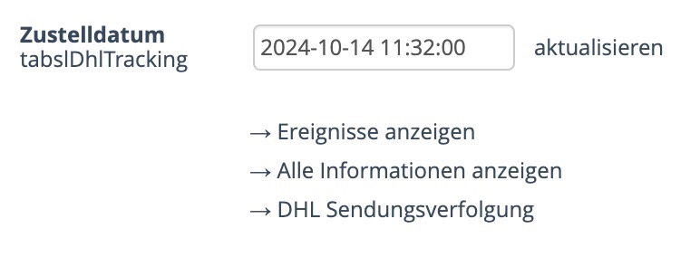

# tabslDhlTracking

OXID eShop module for DHL parcel tracking.

- Get parcel tracking information from DHL api and save to database.
- Save delivery date, if parcel is delivered.
- Show parcel status in admin order page.
- Show all parcel events in admin order page.
- Show all parcel information in admin order page.

## Installation

	composer require tabsl/tabsldhltracking

## Configuration

Add DHL api key (customer key) to the module settings in the admin panel.

## Changelog

    2024-01-21	1.1.3	fix getting parcel status
    2024-01-19	1.1.2	add estimatedTimeOfDelivery to parcel status
    2024-01-19	1.1.1	remove php require
    2024-01-19	1.1.0	improve parcel events, add parcel status
    2024-12-23	1.0.3	add debug option
    2024-12-23	1.0.2	fix parcel country, check multiple parcel numbers
    2024-12-23	1.0.1	fix namespace path
    2024-12-23	1.0.0	initial release

Module for OXID 6.x with smarty (but only admin), so it can be used with own template (twig) in OXID 7.x also.

## License

    This program is free software: you can redistribute it and/or modify
    it under the terms of the GNU General Public License as published by
    the Free Software Foundation, either version 3 of the License, or
    (at your option) any later version.

    This program is distributed in the hope that it will be useful,
    but WITHOUT ANY WARRANTY; without even the implied warranty of
    MERCHANTABILITY or FITNESS FOR A PARTICULAR PURPOSE.  See the
    GNU General Public License for more details.

    You should have received a copy of the GNU General Public License
    along with this program.  If not, see <http://www.gnu.org/licenses/>.

## Copyright

	Tobias Merkl | 2025
	https://oxid-module.eu
